<p align="center">
  <picture>
    <source media="(prefers-color-scheme: dark)" srcset="./dark.svg">
    <source media="(prefers-color-scheme: light)" srcset="./light.svg">
    
  </picture>
</p>

<p align="center">
  <a href="https://github.com/kirithns">GitHub</a> ·
  <a href="https://YOUR_PORTFOLIO_URL">Portfolio</a>
</p>

## About

I'm **Kirith N**, focused on Cloud and DevOps engineering, infrastructure automation, containerization, and CI/CD. I work with AWS, Kubernetes, Terraform, Docker, Jenkins, Linux, and cloud infrastructure to build reliable and scalable environments.

## Focus

* ☁️ **AWS Cloud Infrastructure**
* ⚙️ **DevOps & CI/CD Automation**
* ☸️ **Kubernetes & Container Orchestration**
* 🏗️ **Infrastructure as Code**
* 🐧 **Linux & Cloud Administration**

## Featured Projects

| Project                             | Description                                                                                                                  |
| ----------------------------------- | ---------------------------------------------------------------------------------------------------------------------------- |
| **AWS Infrastructure**              | AWS infrastructure using VPC, subnets, NAT Gateway, route tables, S3, Lambda, DynamoDB and IAM with Terraform.               |
| **Kubernetes Platform**             | Containerized applications deployed using Kubernetes with Deployments, Services, ConfigMaps, Secrets and persistent storage. |
| **CI/CD Automation**                | Automated build and deployment workflows using Jenkins, GitHub, Docker and AWS.                                              |
| **Cloud Infrastructure Automation** | Infrastructure provisioning and management using Terraform across AWS environments.                                          |                             |

## Engineering Stack

### ☁️ Cloud

`AWS` `EC2` `S3` `Lambda` `VPC` `IAM` `DynamoDB` `ALB`

### ⚙️ DevOps

`Terraform` `Docker` `Jenkins` `Git` `GitHub` `CI/CD`

### ☸️ Kubernetes

`Kubernetes` `EKS` `Deployments` `Services` `ConfigMaps` `Secrets` `PV/PVC`

### 🐧 Infrastructure

`Linux` `Ubuntu` `Amazon Linux` `Bash` `Networking`

## Current Learning

```text
AWS
 ├── Cloud Infrastructure
 ├── Networking
 ├── IAM
 ├── Load Balancing
 └── Serverless

DevOps
 ├── Terraform
 ├── Docker
 ├── Jenkins
 ├── Git
 └── CI/CD

Kubernetes
 ├── Deployments
 ├── Services
 ├── ConfigMaps
 ├── Secrets
 ├── PV / PVC
 ├── Node Affinity
 └── EKS
```

## GitHub Contributions

<p align="center">
  <picture>
    <source media="(prefers-color-scheme: dark)" srcset="https://raw.githubusercontent.com/YOUR_GITHUB_USERNAME/github-snake/output/github-snake-dark.svg">
    <source media="(prefers-color-scheme: light)" srcset="https://raw.githubusercontent.com/YOUR_GITHUB_USERNAME/github-snake/output/github-snake.svg">
    
  </picture>
</p>

## Connect

📧 **Email:** [kirithns2201@email.com](mailto:kirithns2201@email.com)

🔗 **GitHub:** https://github.com/kirithns

🌐 **Portfolio:** https://YOUR_PORTFOLIO_URL

## 🐍 GitHub Contributions

<p align="center">
  <picture>
    <source
      media="(prefers-color-scheme: dark)"
      srcset="https://raw.githubusercontent.com/YOUR_GITHUB_USERNAME/YOUR_GITHUB_USERNAME/output/github-snake-dark.svg"
    />

    <source
      media="(prefers-color-scheme: light)"
      srcset="https://raw.githubusercontent.com/YOUR_GITHUB_USERNAME/YOUR_GITHUB_USERNAME/output/github-snake.svg"
    />

    
  </picture>
</p>
